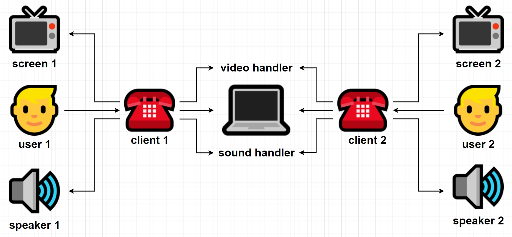

# Voice and video chat using Golang

## What is it?
This is an example of a simple voice and video chat using Golang server and Python client.

## Scheme of logic


## How to run a server?
### Build the project
```
docker-compose build --no-cache
```
### Run
```
docker-compose up
```

## How to run a client?
### Start `client.py` file
Install the libraries:
```
pip install websocket-client
pip install pyaudio
pip install opencv-python
```
Start:
```
python3 client.py
```
